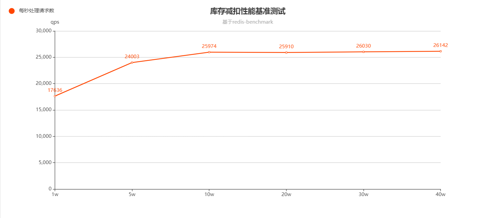
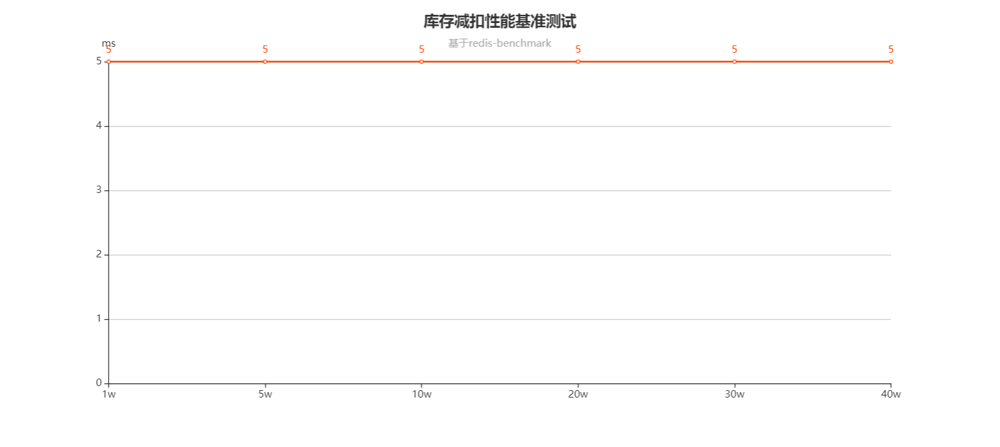

## README
### 1.开发生产环境组件版本
组件 | 版本
--- | :---
mysql | 5.7.35
redis | 5.0.4
rabbitmq | 3.8.0

### 2.项目组件版本依赖选用
组件 | 版本
--- | :---
springboot | 2.6.3
springcloud | 2021.0.1
springcloud-alibaba | 2021.0.1.0
nacos | 1.4.2
sentinel | 1.8.3

### 3.秒杀lua脚本性能
基于redis-benchmark对单一拍品进行性能测试

**扣减库存+返回库存库存号**

**TP99**

